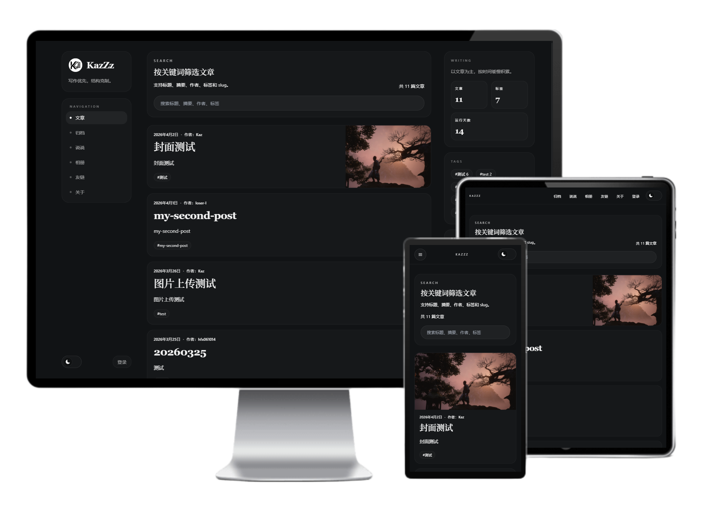
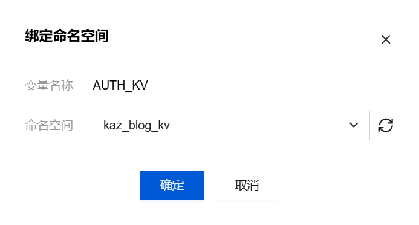
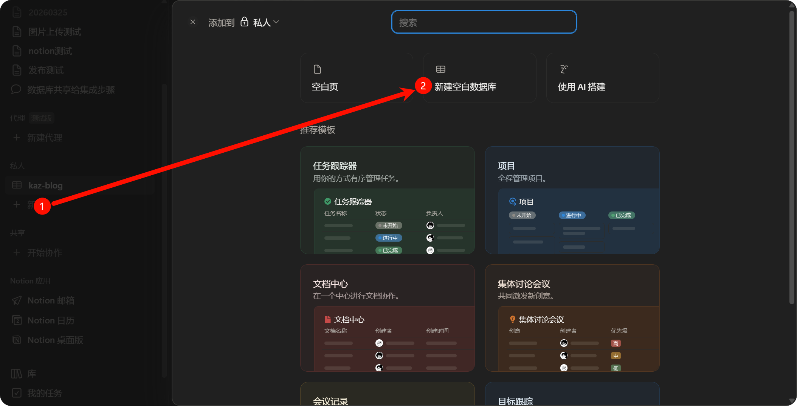
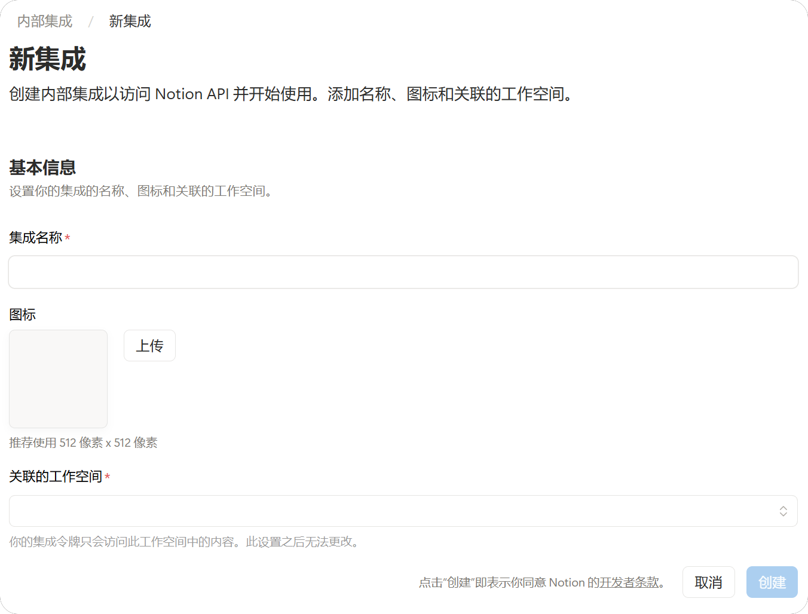
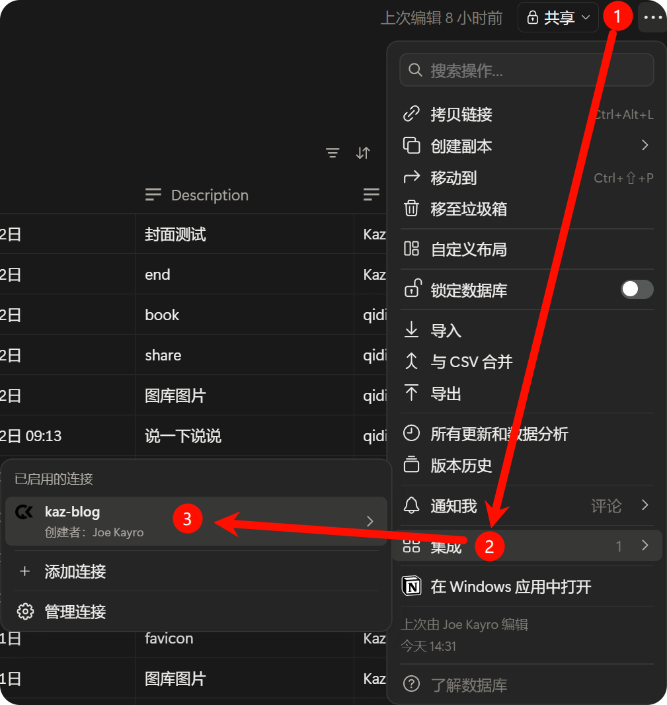

<p align="center">
  <a href="https://kaz-blog.kayro.cn/">
    
  </a>
</p>

<p align="center">
  A personal and multi-author serverless blog system built with Next.js + Notion, designed for deployment on EdgeOne Pages.
</p>

<p align="center">
  <a href="LICENSE"></a>
  <a href="https://github.com/jeoor/kaz-blog"></a>
</p>



---

[简体中文说明](./README.md) | English README

## Demo

Live demo: [https://kaz-blog.kayro.cn/](https://kaz-blog.kayro.cn/)

## Features

- Uses Notion as the primary content source, with local Markdown fallback
- Supports user registration, login, multi-author writing, and author management
- Includes archive, links, tags, search, moments, photos, about page, and Twikoo comments
- Supports light and dark theme switching
- Automatically generates Atom, Sitemap, and Robots
- Supports deployment on EdgeOne Pages

## Best For

- Personal or small multi-author blogs that need lightweight online writing and content management
- Content sites that need multi-author publishing, a minimal admin surface, and lightweight management workflows
- Projects intended to be deployed on EdgeOne Pages

## Quick Start

Production deployment is currently supported on EdgeOne Pages.

### One-click Deployment

You can deploy this project with [Tencent Cloud EdgeOne Pages](https://pages.edgeone.ai/zh).

Click the button below for one-click deployment:

[](https://console.cloud.tencent.com/edgeone/pages/new?repository-url=https%3A%2F%2Fgithub.com%2Fjeoor%2Fkaz-blog)

See the [Tencent Cloud EdgeOne Pages documentation](https://pages.edgeone.ai/zh/document/product-introduction) for more details.

After deployment, you will need to:

- Create a KV namespace for user data and bind it with the variable name AUTH_KV


- Create a [Notion](https://www.notion.so/) database


- Add the following properties to the database. Property names can be customized, but their types must match:
  - Slug (text)
  - Published (checkbox)
  - Date (date)
  - Description (text)
  - Author (text)
  - Keywords (multi-select)
  - Cover (url)

- Create a new [internal integration](https://www.notion.so/my-integrations), select the workspace that owns the database, and grant the database access permission



- Copy the database ID and integration token into the environment variables NOTION_DATABASE_ID and NOTION_TOKEN
  - The database URL format is `https://www.notion.so/[Page ID]?v=[View ID]`, where `Page ID` is your `NOTION_DATABASE_ID`
  - In the internal integration page, copy the `Internal Integration Secret` as `NOTION_TOKEN`

- If you want image upload support, register at [7bu Image Hosting](https://7bu.top/) and put the token into the `IMAGE_HOST_TOKEN` environment variable

> See [.env.example](./.env.example) for more environment variable details.

### Local Development

- Clone the repository

```bash
git clone https://github.com/jeoor/kaz-blog.git
```

- Enter the project directory

```bash
cd kaz-blog
```

- Install dependencies

```bash
npm install
```

- Copy `.env.example` to `.env.local` and fill in the required environment variables, or add them directly in your deployment platform settings

```bash
cp .env.example .env.local
```

- Start the development server

```bash
npm run dev
```

- Or build and run the production version locally

```bash
npm run build && npm run start
```

- Visit `http://localhost:3000`

## Configuration

### Site Configuration

Configure basic site information in [site-config.ts](./site-config.ts).

The About page and Links page do not support direct database editing yet. They still need to be edited locally in [content/about.md](./content/about.md) and [content/links.config.ts](./content/links.config.ts).

### Environment Variables

See the comments in [.env.example](./.env.example) for full details. The most commonly used variables are listed below:

| Variable | Required | Description |
| --- | --- | --- |
| AUTH_KV_BINDING | Required when auth is enabled | EdgeOne KV binding name, usually AUTH_KV |
| REGISTER_INVITE_CODE | Recommended when open registration is disabled | Invite code used for registration |
| NOTION_TOKEN | Required when using Notion as the content source | Notion internal integration secret |
| NOTION_DATABASE_ID | Required when using Notion as the content source | Notion database ID |
| IMAGE_HOST_TOKEN | Optional | 7bu image hosting token for uploads |

## Project Structure

- app/: App Router pages, layouts, routes, and metadata, including sitemap, robots, and atom
- components/: Reusable UI components for layout, posts, comments, photos, moments, and more
- lib/: Content loading layer, Notion/local fallback adapters, and shared utilities
- cloud-functions/cfapi/: EdgeOne Cloud Functions for admin APIs, sessions, and post management
- content/: Local content and configuration for about, links, photos, moments, and post fallback
- public/: Static assets
- scripts/: Utility scripts such as the Notion config checker
- site-config.ts: Global site metadata, navigation, and other site-level settings
- edgeone.json: EdgeOne Pages and Functions deployment configuration

## Current Capabilities

- [x] Notion as the primary content source with local fallback
- [x] Multi-author registration and login
- [x] Publishing, loading, and deleting posts
- [x] Archive, tags, and search
- [x] Moments, photos, and online post configuration
- [x] Atom Feed, Sitemap, and Robots
- [x] Twikoo comments
- [x] Light and dark theme switching
- [x] EdgeOne Pages deployment
- [ ] Online site settings configuration
- [ ] Online configuration for the About page
- [ ] Online configuration for links

## Content Source Priority

1. Notion Database
2. content/posts/*.md local fallback

Note: local fallback content is mainly intended for development and demos, and is not recommended as the long-term primary content source in production.

## Common Commands

- npm run notion:check: check Notion configuration
- npm run dev: start local development
- npm run dev:stable: start the dev server with a more stable command on Windows PowerShell
- npm run clean: clear the .next cache
- npm run lint: run lint checks
- npm run build: production build
- npm run start: start the production server

## License

[MIT](./LICENSE)